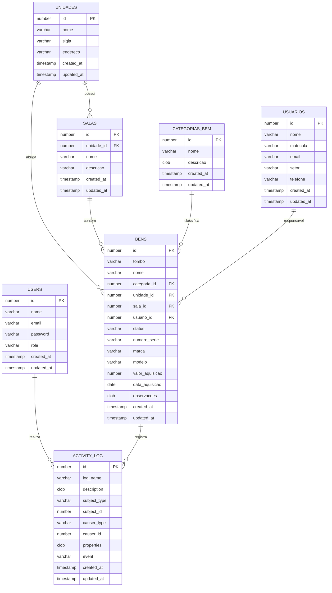

# DER — Diagrama Entidade-Relacionamento

Representação visual das entidades e seus relacionamentos no banco de dados.

---

## Diagrama (Mermaid)



---

## Legenda de Cardinalidade

| Notação  | Significado                        |
|----------|------------------------------------|
| `\|\|`   | Exatamente um (obrigatório)        |
| `\|o`    | Zero ou um (opcional)              |
| `\}\{`   | Um ou mais (obrigatório)           |
| `\}o`    | Zero ou mais (opcional)            |

---

## Resumo dos Relacionamentos

```
UNIDADES ──────────┬──────── SALAS
         (1)       │         (N)
                   │
                   ├──────── BENS
                   │         (N)
                   │
SALAS ─────────────┘
(1) ──────────────── BENS (N)

CATEGORIAS_BEM (1) ── BENS (N)
USUARIOS       (1) ── BENS (N)  [responsável]

USERS          (1) ── ACTIVITY_LOG (N)  [causer]
BENS           (1) ── ACTIVITY_LOG (N)  [subject]
```

---

## Chaves Estrangeiras

| Tabela Filha  | Coluna FK    | Tabela Pai    | Coluna PK | ON DELETE    |
|---------------|--------------|---------------|-----------|--------------|
| salas         | unidade_id   | unidades      | id        | RESTRICT     |
| bens          | categoria_id | categorias_bem| id        | RESTRICT     |
| bens          | unidade_id   | unidades      | id        | RESTRICT     |
| bens          | sala_id      | salas         | id        | SET NULL     |
| bens          | usuario_id   | usuarios      | id        | SET NULL     |

> **Nota:** `sala_id` e `usuario_id` em `bens` são NULLable, pois um bem pode existir sem sala definida ou sem responsável atribuído.

---

## Índices

| Tabela    | Índice                | Colunas                      | Tipo   |
|-----------|-----------------------|------------------------------|--------|
| bens      | idx_bens_tombo        | tombo                        | UNIQUE |
| bens      | idx_bens_unidade      | unidade_id                   | Normal |
| bens      | idx_bens_sala         | sala_id                      | Normal |
| bens      | idx_bens_categoria    | categoria_id                 | Normal |
| bens      | idx_bens_status       | status                       | Normal |
| salas     | idx_salas_unidade     | unidade_id                   | Normal |
| users     | idx_users_email       | email                        | UNIQUE |
| usuarios  | idx_usuarios_email    | email                        | UNIQUE |
| usuarios  | idx_usuarios_matricula| matricula                    | UNIQUE |
| activity_log | idx_al_subject     | subject_type, subject_id     | Normal |
| activity_log | idx_al_causer      | causer_type, causer_id       | Normal |
| activity_log | idx_al_event       | event                        | Normal |
| activity_log | idx_al_log_name    | log_name                     | Normal |
